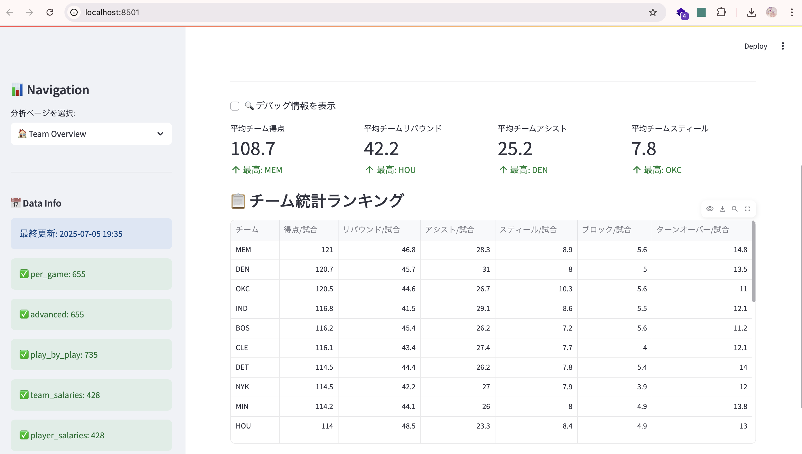
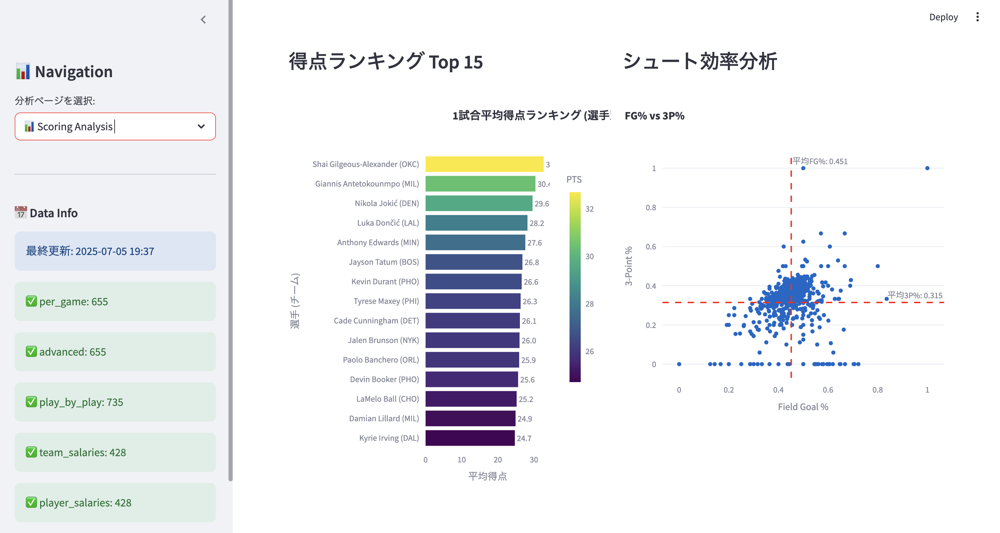
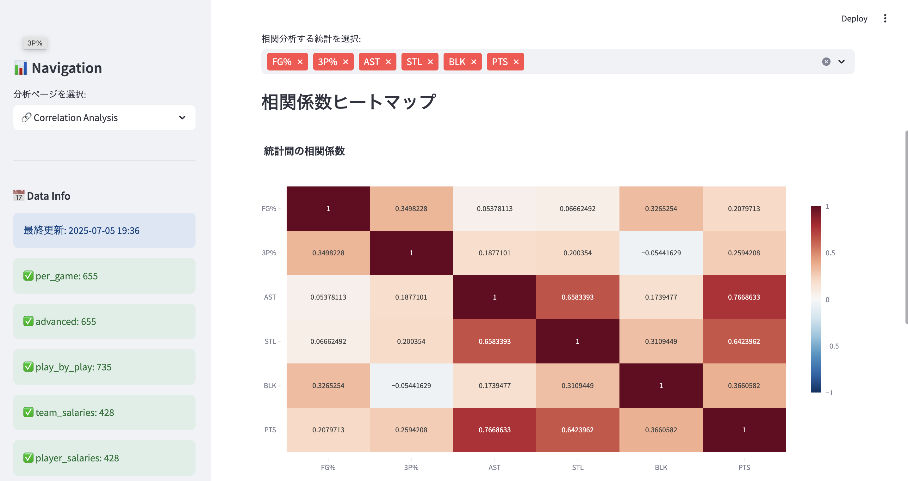

# NBA Analytics Dashboard

2024-25シーズンのNBAデータを分析・可視化する包括的なダッシュボードアプリケーション。Streamlitをベースとした対話型の統計分析プラットフォームです。

   

## 🏀 プロジェクト概要

このプロジェクトは、NBA統計分析を通じて現代的なデータ分析スキルを実証するポートフォリオ作品です。データエンジニアリング、統計分析、ウェブ開発、クラウドデプロイメントのスキルを包括的に示しています。

### 🎯 主要機能

- **7つの包括的分析モジュール**: 基本的なチーム概要から高度な統計相関まで
- **対話型データ可視化**: Plotly統合による動的チャートとグラフ
- **リアルタイムデータ処理**: 効率的なデータロードとキャッシュ機構
- **レスポンシブウェブインターフェース**: Streamlitで構築された直感的なUI
- **クラウド対応アーキテクチャ**: Dockerコンテナ化とAWS App Runnerデプロイメント

## 🛠️ 技術スタック

- **バックエンド**: Python 3.9+, Pandas, NumPy
- **フロントエンド**: Streamlit, Plotly, HTML/CSS
- **データ処理**: カスタムローダーを持つJSONベースのデータパイプライン
- **デプロイメント**: Docker, AWS App Runner
- **データソース**: NBA公式統計（スクレイピングと加工済み）

## 📊 分析モジュール

1. **チーム概要** - 包括的なチーム統計ダッシュボード
2. **スコアリング分析** - 高度なシュート効率指標
3. **チーム比較** - レーダーチャートによる複数チーム統計分析
4. **高度な分析** - NBA特有の高度指標（PER、PIEなど）
5. **サラリー効率** - パフォーマンス対年俸分析
6. **相関分析** - 指標間の統計的関係性
7. **データエクスプローラー** - カスタムデータ探索インターフェース

## 🚀 クイックスタート

### ローカル開発

```bash
# リポジトリのクローン
git clone https://github.com/your-username/nba-dashboard.git
cd nba-dashboard

# 仮想環境の作成
python -m venv venv
source venv/bin/activate  # Windows: venv\Scripts\activate

# 依存関係のインストール
pip install -r requirements.txt

# アプリケーションの実行
streamlit run main.py
```

### Dockerデプロイメント

```bash
# イメージのビルド
docker build -t nba-dashboard .

# コンテナの実行
docker run -p 8080:8080 nba-dashboard
```


## 📸 ダッシュボードプレビュー

### チーム概要


### スコアリング分析


### 相関分析


## 📈 プロジェクトハイライト

### データエンジニアリング
- NBA統計用カスタムデータスクレイパー
- 効率的なJSONベースのデータ保存・取得
- 堅牢なエラーハンドリングとデータ検証
- メモリ最適化されたデータ処理

### 統計分析
- 高度なNBA指標計算
- 複数変数間の相関分析
- パフォーマンス効率アルゴリズム
- トレンド分析と比較統計

### ユーザーエクスペリエンス
- 直感的なナビゲーションとフィルタリング
- ホバー詳細付き対話型可視化
- 様々な画面サイズに対応するレスポンシブデザイン
- リアルタイムデータ更新

### DevOps & デプロイメント
- Dockerによるコンテナ化アプリケーション
- AWS App Runner統合
- CI/CD対応設定
- スケーラブルアーキテクチャ設計

## 🔧 技術実装

### アーキテクチャ
```
nba-dashboard/
├── app.py              # 本番用エントリーポイント
├── main.py             # 開発用エントリーポイント
├── config.py           # 設定管理
├── modules/            # 分析モジュール
│   ├── team_overview.py
│   ├── scoring_analysis.py
│   └── ...
├── data/               # データ処理層
├── utils/              # ユーティリティ関数
├── scraper/            # データ収集ツール
└── nba_data/           # JSONデータストレージ
```

### 主要技術
- **Streamlit**: 迅速なウェブアプリ開発
- **Plotly**: 対話型データ可視化
- **Pandas**: データ操作と分析
- **NumPy**: 数値計算
- **Docker**: コンテナ化

## 📊 データソース

- NBA公式チーム統計
- 選手パフォーマンス指標
- 年俸情報
- 高度な分析指標（PER、True Shooting %など）

*データはカスタムスクレイパーを通じて収集され、定期的に更新されます*

## 🔮 今後の拡張予定

- [ ] 機械学習による予測機能
- [ ] 選手比較モジュール
- [ ] 過去トレンド分析
- [ ] リアルタイムデータ用API統合
- [ ] モバイルアプリ開発

## 👨‍💻 開発者について

このプロジェクトは以下の専門知識を実証しています：
- **データ分析**: 統計分析と可視化
- **フルスタック開発**: エンドツーエンドのアプリケーション開発
- **クラウド技術**: モダンなデプロイメント手法
- **スポーツアナリティクス**: ドメイン固有の知識応用

